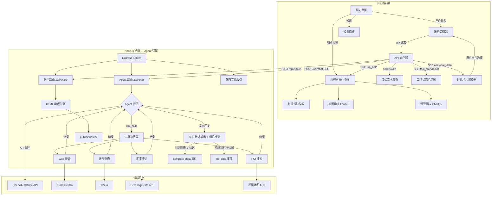

## 产品概述

一个通用的 AI 旅游规划助手 Web 应用（Agent 架构）。用户通过对话式聊天界面描述旅行需求，AI 大模型借助多种工具（Web搜索、天气查询、汇率查询、POI搜索）实时获取可靠信息，采用渐进式规划流程（锁定约束→搭建框架→逐步填充），在需要用户决策时通过交互式对比卡片辅助选择，最终生成个性化的结构化旅行行程。行程以精美的可视化页面呈现，支持一键分享。

## 核心功能

### 1. 对话式 AI 规划（Agent 模式 + 渐进式规划）

- 聊天界面，用户用自然语言描述旅行需求
- AI 遵循渐进式规划方法论：先锁定硬性约束，再搭建行程框架，逐步填充细节
- AI 自动判断何时调用工具获取实时信息，流式输出回复
- 支持多轮对话追问和修改行程

### 2. 实时信息工具集

- Web搜索（签证、机票酒店价格、景点信息、PADI等官方来源）
- 天气查询（目的地天气预报）
- 汇率实时查询（多币种预算换算）
- POI/地点搜索（餐厅、景点、酒店坐标和评分）

### 3. 交互式对比决策卡片

- AI 在需要用户选择时输出结构化对比数据，前端渲染为并列对比卡片
- 支持全场景对比：景点、交通方案、住宿、路线方案、餐厅美食
- 每个选项卡片可点击"选择"按钮，AI 自动继续规划
- 同时支持用户在聊天中文字回复选择
- AI 可标注推荐选项，推荐项加特殊视觉标识

### 4. 信息来源标注

- AI 回复中对关键信息标注来源链接
- 行程中包含参考来源汇总列表

### 5. 行程可视化展示

- 结构化行程自动渲染为精美时间线页面
- 每日安排、预算图表、地图标记、美食住宿推荐、实用贴士

### 6. 分享功能

- 一键生成独立的静态 HTML 分享页面，通过链接分享

### 7. 设置面板

- 配置 API Key（OpenAI/Claude）、模型选择、Key 本地存储

## 技术栈

- **前端**：HTML + CSS（Tailwind CSS CDN）+ JavaScript（原生，无构建依赖）
- **后端**：Node.js + Express（轻量 API 代理 + Agent 工具执行引擎）
- **AI 接入**：OpenAI API（Function Calling）/ Anthropic Claude API（Tool Use），用户提供 Key
- **Web 搜索**：DuckDuckGo HTML 搜索（后端 fetch 抓取，免费无需 Key）
- **天气查询**：wttr.in JSON API（免费无需 Key）
- **汇率查询**：open.er-api.com 免费端点
- **POI/地图**：Leaflet + OpenStreetMap（前端）；腾讯地图 WebService API（后端 POI 搜索）
- **图表**：Chart.js（CDN，预算环形图）
- **图标**：Font Awesome 6（CDN）
- **字体**：Google Fonts — Poppins + Noto Sans SC
- **Markdown 渲染**：marked.js（CDN）

## 实现方案

### 整体策略 — Agent 架构 + 渐进式规划

后端作为 Agent 执行引擎，定义工具集（web_search、get_weather、get_exchange_rate、search_poi），通过大模型 Function Calling 机制让 AI 自主调用工具。AI 遵循渐进式规划方法论（参考 `travel-planning-methodology.md`），分阶段与用户协作。

**Agent 执行循环**：

1. 用户消息 + 聊天历史发送到后端
2. 后端将消息连同工具定义 + System Prompt（含方法论和知识库）发送给大模型
3. 大模型返回文本回复或 tool_calls
4. 若为 tool_calls：后端执行工具，结果追加到消息列表，再次调用大模型
5. 循环直到大模型返回最终文本回复
6. 全程 SSE 流式传输，工具调用和对比数据通过特殊事件类型推送

### 对比决策卡片 — 核心技术设计

**数据流**：AI 在回复中输出特殊标记 `[COMPARE_START]...[COMPARE_END]` 包裹结构化 JSON → 后端通过 SSE 发送 `event: compare_data` 事件 → 前端 chat.js 检测并渲染对比卡片组件 → 用户点击选项按钮 → 前端自动发送选择消息（如"我选择方案A：吉隆坡+沙巴路线"）→ AI 收到后继续规划。

**通用对比数据 Schema**：

```javascript
{
  type: "comparison",
  title: "交通方案对比",          // 对比标题
  description: "从吉隆坡到仙本那", // 对比描述
  dimensions: ["价格", "耗时", "舒适度", "推荐指数"], // 对比维度
  options: [
    {
      id: "A",
      name: "直飞斗湖",
      recommended: true,          // 是否推荐
      tag: "最快",                // 角标标签
      values: {
        "价格": "约 350 MYR",
        "耗时": "2.5 小时",
        "舒适度": "高",
        "推荐指数": "4.5/5"
      },
      pros: ["省时", "直达"],
      cons: ["价格较高"],
      source: "https://..."       // 来源链接（可选）
    },
    // ...更多选项
  ]
}
```

此 Schema 适配所有对比场景（景点/交通/住宿/路线/餐厅），通过 `dimensions` 和 `values` 的灵活组合实现通用化。

### SSE 事件类型扩展

| 事件类型 | 数据格式 | 用途 |
| --- | --- | --- |
| `event: token` | 文本片段 | AI 流式文本输出 |
| `event: tool_start` | `{ name, arguments }` | 工具调用开始 |
| `event: tool_result` | `{ name, summary }` | 工具调用完成 |
| `event: compare_data` | 对比 JSON | 对比卡片数据 |
| `event: trip_data` | 行程 JSON | 结构化行程数据 |
| `event: done` | — | 完成 |
| `event: error` | 错误信息 | 错误 |


### 关键技术决策

1. **对比数据提取策略**：后端在 SSE 流式输出过程中，使用缓冲区检测 `[COMPARE_START]...[COMPARE_END]` 标记。检测到完整标记后，解析内部 JSON，通过 `event: compare_data` 发送给前端，标记内容不作为普通文本输出。同理处理 `[TRIP_DATA_START]...[TRIP_DATA_END]`。

2. **对比卡片点击交互**：用户点击选项按钮后，前端构造消息如 `"我选择方案A：直飞斗湖"` 并自动发送。这样 AI 在聊天历史中能看到用户的选择，自然地继续对话流程。同时支持用户直接打字回复。

3. **System Prompt 分层设计**：

- 核心角色定义 + 渐进式规划方法论（来自 `travel-planning-methodology.md`）
- 工具使用策略 + 来源标注规则
- 对比输出规范（何时使用、JSON Schema、Few-shot 示例）
- 结构化行程输出规范（JSON Schema）
- 知识库内容按需注入（检测到目的地/活动时拼接对应知识库）

4. **知识库按需加载**：后端在组装 System Prompt 时，根据对话上下文关键词检测，动态拼接对应的知识库内容（如检测到"马来西亚"拼接 `knowledge-malaysia.md`，检测到"潜水"拼接 `knowledge-diving.md`），避免 token 浪费。

5. **后端代理模式**：API Key 由前端每次请求时附带在请求头中，后端仅做转发，不持久化。

6. **分享页面生成**：后端将行程 JSON 注入预制 HTML 模板，生成独立静态文件保存到 `public/shares/`，通过唯一 UUID 访问。

### 性能与可靠性

- 工具调用超时控制：每个工具 10 秒超时，超时返回 fallback
- SSE 流式传输全程，工具调用期间前端展示实时状态
- 工具调用结果缓存：同一会话相同查询参数缓存 5 分钟
- JSON 解析容错：对 AI 输出的结构化数据做多层容错
- 对比数据渲染容错：字段缺失时优雅降级显示

## 架构设计



## 目录结构

```
project-root/
├── server.js                       # [NEW] Express 后端入口。Agent 路由 /api/chat（SSE + Agent 循环 + 流式标记检测）、/api/share（分享页面生成）、静态文件托管。实现 OpenAI/Anthropic 适配层，流式输出中检测 COMPARE 和 TRIP_DATA 标记并转换为对应 SSE 事件
├── tools/
│   ├── index.js                    # [NEW] 工具注册中心。导出 schema 定义和执行函数映射，统一超时控制和结果缓存
│   ├── web-search.js               # [NEW] Web 搜索。DuckDuckGo 搜索，解析返回结果提取标题、摘要、URL
│   ├── weather.js                  # [NEW] 天气查询。wttr.in JSON API，返回天气预报数据
│   ├── exchange-rate.js            # [NEW] 汇率查询。open.er-api.com，支持任意货币对换算
│   └── poi-search.js               # [NEW] POI 搜索。腾讯地图 WebService API，返回地点信息和坐标
├── prompts/
│   ├── system-prompt.js            # [NEW] System Prompt 组装器。拼接角色定义、方法论、工具策略、对比输出规范、来源标注规则、结构化输出 Schema。根据对话关键词动态注入知识库
│   └── knowledge/
│       ├── methodology.js          # [NEW] 渐进式规划方法论（从 travel-planning-methodology.md 转译）
│       ├── malaysia.js             # [NEW] 马来西亚知识库（从 knowledge-malaysia.md 转译）
│       └── diving.js               # [NEW] 潜水知识库（从 knowledge-diving.md 转译）
├── package.json                    # [NEW] 项目配置。dependencies: express, openai, @anthropic-ai/sdk, uuid
├── .env.example                    # [NEW] 环境变量示例。TMAP_WEBSERVICE_KEY、PORT
├── public/
│   ├── index.html                  # [NEW] 前端主页面。三大视图容器（聊天、行程、设置）HTML 骨架
│   ├── css/
│   │   └── style.css               # [NEW] 全局样式。聊天气泡、工具状态指示器、对比卡片组件、行程卡片、时间线、地图容器、来源标注、响应式布局、深色主题、动画关键帧
│   ├── js/
│   │   ├── app.js                  # [NEW] 前端主入口。视图路由、模块初始化、全局事件、Toast 通知
│   │   ├── chat.js                 # [NEW] 聊天模块。SSE 连接、流式文本渲染、工具状态事件、对比卡片事件（检测 compare_data 渲染对比组件、绑定选择按钮点击自动发消息）、行程数据事件、Markdown 渲染（含来源链接）、消息历史 localStorage
│   │   ├── compare-card.js         # [NEW] 对比卡片渲染器。接收对比 JSON，渲染为并列卡片布局（2-3列，超过3个横向滚动）。每列含选项名、对比维度值、优缺点、推荐标识、来源链接、"选择此方案"按钮。按钮点击触发 onSelect 回调。差异项自动高亮。推荐选项加渐变边框
│   │   ├── trip-renderer.js        # [NEW] 行程可视化渲染器。每日时间线、各类卡片、预算环形图、美食住宿推荐、贴士手风琴、来源列表、天数切换
│   │   ├── map.js                  # [NEW] 地图模块。Leaflet + OpenStreetMap，景点标记、路线连线、弹窗详情
│   │   ├── share.js                # [NEW] 分享模块。调用后端生成分享页、复制链接、Toast 提示
│   │   ├── settings.js             # [NEW] 设置模块。Provider/Key/模型配置、localStorage 存储、验证
│   │   └── utils.js                # [NEW] 工具函数。日期/货币格式化、UUID、DOM 辅助、JSON 容错解析
│   └── shares/
│       └── .gitkeep                # [NEW] 占位
└── templates/
    └── share-template.html         # [NEW] 分享页面模板。自包含的行程展示 HTML，内嵌 CDN 资源，行程 JSON 通过模板变量注入
```

## 设计风格

采用现代深色主题 AI 工具界面风格，融合旅行元素。聊天界面以深色背景为主调，行程可视化页面切换为热带渐变色调和玻璃拟态卡片。工具调用和对比决策过程可视化展示，增强用户信任感和参与感。

## 页面规划

### 视图 1：聊天界面（主视图）

- **顶部导航栏**：固定顶部，深色玻璃拟态背景（rgba(15,23,42,0.85) + backdrop-blur），左侧应用 Logo 和名称"AI Travel Planner"，中部三个导航标签（对话/行程/设置），选中标签带底部渐变色滑块动画，右侧当前模型名称和连接状态圆点
- **欢迎引导区**：首次打开显示在聊天区中央，大号渐变色地球图标，主标题"你好，我是你的 AI 旅行规划师"（渐变色文字），副标题"告诉我你的旅行梦想，我来帮你实现"，下方三张快捷提问卡片（半透明深色背景，悬浮发光边框）
- **聊天消息区**：深色背景，消息区域最大宽度 840px 居中。AI 消息靠左带青绿渐变左边框，用户消息靠右带主题色渐变气泡。来源链接渲染为可点击标签样式
- **工具调用状态指示器**：半透明卡片，旋转加载图标 + 描述文字，完成后变绿色勾 + 结果摘要
- **对比决策卡片**：嵌入消息流中的交互组件。并列 2-3 列卡片布局（深色半透明背景 + 细边框），每列顶部选项名称，中间为对比维度列表（差异项高亮），底部"选择此方案"渐变按钮。推荐选项卡片加青绿渐变边框和"推荐"角标。超过 3 个选项时横向滚动。卡片悬浮微放大 + 边框发光
- **输入区域**：底部固定，圆角输入框（聚焦时青绿色微光边框），右侧渐变发送按钮，支持多行扩展

### 视图 2：行程可视化页面

- **行程头部横幅**：渐变色背景（青绿到翠绿斜向渐变），目的地名称、日期、人数和预算徽章，底部"返回对话"和"分享行程"按钮
- **天数 Tab 栏**：吸顶横向滚动，每天圆角标签"Day X · 城市"，选中态渐变填充
- **每日时间线**：左侧渐变竖线，右侧活动卡片（景点青绿标签/餐饮橙色/交通蓝色），含时间、描述、费用、来源链接
- **地图区域**：Leaflet 地图，景点标记 + 路线连线 + 弹窗详情
- **预算概览**：环形图 + 分类卡片列表
- **美食住宿推荐**：双栏网格卡片
- **实用贴士**：手风琴列表
- **参考来源**：底部来源汇总

### 视图 3：设置面板

- **API 配置卡片**：Provider 切换按钮组、API Key 密码输入框、模型下拉、验证按钮
- **使用说明**：步骤说明卡片

## 交互与动画

- 聊天流式输出带光标闪烁
- 工具调用状态旋转加载动画
- 对比卡片入场交错淡入，悬浮微放大 + 边框发光
- 对比卡片选择按钮点击后，选中项卡片高亮，其他变淡
- 视图切换水平滑动过渡
- 行程卡片滚动入场交错淡入
- 按钮悬浮发光涟漪效果
- 分享成功 Toast 底部滑入自动消失

## 响应式设计

- 桌面端（大于 1024px）：对比卡片并列 2-3 列，行程双栏
- 平板端（768-1024px）：对比卡片 2 列，行程单栏
- 移动端（小于 768px）：对比卡片纵向堆叠或横向滚动，汉堡菜单

## Agent Extensions

### Skill

- **tencentmap-lbs-skill**
- 用途：为 POI 搜索工具（tools/poi-search.js）提供腾讯地图 WebService API 集成，实现景点、餐厅、酒店等地点搜索，获取名称、地址、坐标、评分数据
- 预期结果：获取腾讯地图 API Key 配置方式，实现 poi-search.js 中的地点搜索和周边搜索功能，返回结构化 POI 数据供 AI Agent 使用

- **多模态内容生成**
- 用途：生成聊天界面欢迎区域的旅行主题装饰图片
- 预期结果：生成一张现代风格的旅行主题 Hero 装饰图