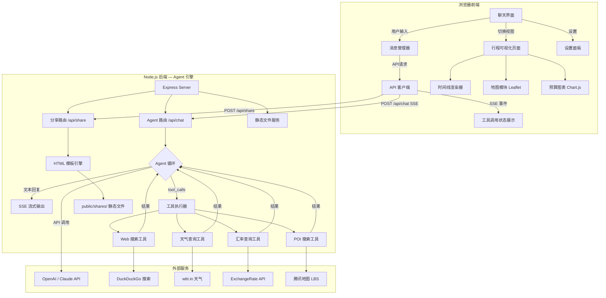

## 产品概述

一个通用的 AI 旅游规划助手 Web 应用（Agent 架构）。用户通过对话式聊天界面描述旅行需求，AI 大模型借助多种工具（Web搜索、天气查询、汇率查询、POI搜索）实时获取可靠信息，生成个性化的结构化旅行行程。生成的行程以精美的可视化页面呈现，并支持一键生成独立的分享链接。所有信息附带来源链接，确保可靠性。

## 核心功能

### 1. 对话式 AI 规划（Agent 模式）

- 聊天界面，用户用自然语言描述旅行需求
- AI 逐步引导用户完善需求（目的地、出行日期、天数、人数、预算、兴趣偏好等）
- AI 回复支持流式输出（打字机效果），支持多轮对话追问和修改
- AI 自动判断何时需要调用工具获取实时信息，无需用户手动触发

### 2. 实时信息工具集

- **Web搜索**：搜索景点开放时间、签证政策、PADI潜水考证等官方信息；搜索机票和酒店价格参考
- **天气查询**：获取目的地历史天气和预测天气，辅助行程安排和穿搭建议
- **汇率查询**：获取最新汇率，用于准确的多币种预算换算
- **POI/地点搜索**：搜索餐厅、景点、ATM、医院等实用地点及坐标信息

### 3. 信息来源标注

- AI 回复中对关键信息标注来源链接（如 PADI 官网、景点官网、携程/Booking 链接等）
- 生成的行程中包含「参考来源」列表

### 4. 行程可视化展示

- AI 生成的结构化行程自动渲染为精美的时间线页面
- 包含每日安排（景点、餐饮、交通）、预算估算、住宿推荐、美食推荐、实用贴士
- 交互式地图标记景点，按天切换查看

### 5. 分享功能

- 一键生成独立的行程分享页面（静态 HTML），通过链接分享，无需登录即可查看

### 6. 设置面板

- 配置大模型 API Key（支持 OpenAI / Claude）
- 模型选择，API Key 仅存本地

## 技术栈

- **前端**：HTML + CSS（Tailwind CSS CDN）+ JavaScript（原生，无构建依赖）
- **后端**：Node.js + Express（轻量 API 代理 + Agent 工具执行引擎）
- **AI 接入**：OpenAI API（Function Calling）/ Anthropic Claude API（Tool Use），用户提供 Key
- **Web 搜索**：DuckDuckGo Instant Answer API（免费无需 Key）+ 备选 Tavily API
- **天气查询**：wttr.in API（免费无需 Key，支持全球城市）
- **汇率查询**：ExchangeRate-API 免费端点（api.exchangerate-api.com）
- **POI/地图**：Leaflet + OpenStreetMap（前端展示）；腾讯地图 LBS 通过 skill 获取 POI 数据
- **图表**：Chart.js（CDN，预算环形图）
- **图标**：Font Awesome 6（CDN）
- **字体**：Google Fonts — Poppins + Noto Sans SC
- **Markdown 渲染**：marked.js（CDN）
- **分享导出**：html2canvas（CDN，可选长图导出）

## 实现方案

### 整体策略 — Agent 架构

本项目采用 **AI Agent 架构**，而非简单的 Chat Completion。后端作为 Agent 执行引擎，定义一组工具（web_search、weather、exchange_rate、poi_search），通过大模型的 Function Calling / Tool Use 机制，让 AI 自主决定何时调用哪个工具获取实时信息，再基于工具返回结果生成可靠的行程规划。

**Agent 执行循环**：

1. 用户消息 + 聊天历史发送到后端
2. 后端将消息连同工具定义（tools schema）发送给大模型 API
3. 大模型返回：普通文本回复 **或** 工具调用请求（tool_calls）
4. 若为工具调用：后端执行对应工具函数，将结果作为 tool message 追加到消息列表，再次调用大模型
5. 循环直到大模型返回最终文本回复
6. 全程通过 SSE 流式传输给前端，工具调用过程实时展示状态

### 关键技术决策

1. **Agent 工具循环**：后端实现 while 循环处理大模型可能的多次工具调用（一次规划可能先搜索签证政策、再查天气、再查汇率），直到大模型给出最终回复。OpenAI 使用 `tool_choice: "auto"` + `tools` 参数，Anthropic 使用 `tool_use` block 机制。

2. **工具执行与 SSE 融合**：工具调用过程中，后端通过 SSE 发送特殊事件类型（`event: tool_start`、`event: tool_result`），前端实时展示"正在搜索机票价格..."等状态指示器，用户可见 AI 的思考和调查过程。

3. **免费工具链选择**：

- **Web 搜索**：优先使用 DuckDuckGo HTML 搜索（通过后端 fetch 抓取，免费无限制）；System Prompt 中指导 AI 在搜索结果中提取并标注原始来源链接
- **天气**：wttr.in JSON API（`wttr.in/CityName?format=j1`），完全免费，覆盖全球
- **汇率**：open.er-api.com/v6/latest/CNY，免费无需注册
- **POI 搜索**：通过腾讯地图 skill 获取高质量中文 POI 数据

4. **信息来源标注机制**：在 System Prompt 中严格要求 AI 对每条关键信息标注来源（格式：`[来源: 链接]`）。工具返回结果时附带 URL，AI 引用时自动包含。前端 Markdown 渲染器将来源链接渲染为可点击的标注样式。

5. **结构化行程输出**：AI 在确认行程后，输出包含 `[TRIP_DATA_START]...[TRIP_DATA_END]` 标记的 JSON 数据。前端检测到标记后自动解析并渲染可视化页面。

6. **分享页面生成**：后端将行程 JSON 注入预制 HTML 模板，生成独立静态文件保存到 `public/shares/`，通过唯一 UUID 访问。

### 性能与可靠性

- 工具调用超时控制：每个工具调用设置 10 秒超时，超时返回 fallback 信息
- SSE 流式传输全程，工具调用期间前端展示实时状态，不会让用户等待黑屏
- 工具调用结果缓存：同一会话中相同查询参数的工具调用结果缓存 5 分钟，避免重复请求
- JSON 解析容错：对 AI 输出的结构化数据做多层容错（尝试提取 JSON 块、修复常见格式错误）
- API Key 不持久化到后端，仅在请求头中传输

### 实现注意事项

- **System Prompt 设计**是核心：需精心编写，包含角色定义、工具使用策略、来源标注要求、结构化输出 Schema 和 Few-shot 示例
- OpenAI 和 Anthropic 的工具调用 API 格式不同，后端需要适配层统一处理
- DuckDuckGo 搜索结果需后端解析 HTML/JSON 提取摘要和链接，不是简单 API 调用
- 工具调用链可能较长（5-8 轮），需要注意 token 消耗和响应时间的平衡

## 架构设计



### 数据流

1. **Agent 对话流**：用户输入 → POST /api/chat → 后端组装 messages + tools schema → 调用大模型 → 若返回 tool_calls → 执行工具 → 结果追加到 messages → 再次调用大模型 → ... → 最终文本回复 SSE 流式返回前端
2. **工具状态流**：工具调用开始 → SSE event: tool_start（前端显示"正在搜索..."）→ 工具执行完成 → SSE event: tool_result（前端显示结果摘要）→ AI 继续处理
3. **行程生成流**：AI 最终回复包含 `[TRIP_DATA_START]` 标记 → 前端检测并提取 JSON → 自动切换行程可视化视图 → 渲染时间线/地图/预算
4. **分享流**：用户点击分享 → POST /api/share（行程 JSON）→ 后端生成静态 HTML → 返回分享 URL

## 目录结构

```
project-root/
├── server.js                       # [NEW] Express 后端入口。包含 Agent 核心路由 /api/chat（SSE 流式 + Agent 工具循环）、/api/share（分享页面生成）、静态文件托管。实现 OpenAI 和 Anthropic 两种 API 的适配层
├── tools/
│   ├── index.js                    # [NEW] 工具注册中心。导出所有工具的 schema 定义（符合 OpenAI function calling 格式）和执行函数映射表。统一工具超时控制和结果缓存逻辑
│   ├── web-search.js               # [NEW] Web 搜索工具。使用 DuckDuckGo 搜索，解析返回结果提取标题、摘要、URL。支持指定搜索关键词和结果数量。返回格式化的搜索结果含来源链接
│   ├── weather.js                  # [NEW] 天气查询工具。调用 wttr.in JSON API，获取指定城市当前天气和未来 3 天预报。返回温度、湿度、降雨概率、穿搭建议
│   ├── exchange-rate.js            # [NEW] 汇率查询工具。调用 open.er-api.com 获取最新汇率。支持任意货币对之间的换算。返回汇率值和更新时间
│   └── poi-search.js               # [NEW] POI 搜索工具。封装腾讯地图 WebService API 进行地点搜索。支持关键词搜索和周边搜索，返回地点名称、地址、坐标、评分
├── prompts/
│   └── system-prompt.js            # [NEW] System Prompt 定义。包含 AI 旅行规划师角色设定、工具使用策略、来源标注规则、结构化行程 JSON Schema 定义和 Few-shot 输出示例
├── package.json                    # [NEW] 项目配置。dependencies: express, openai, @anthropic-ai/sdk, uuid, node-fetch
├── .env.example                    # [NEW] 环境变量示例。TMAP_WEBSERVICE_KEY（腾讯地图）、PORT、可选默认 API Key
├── public/                         # 前端静态资源目录
│   ├── index.html                  # [NEW] 前端主页面。三大视图容器（聊天界面、行程可视化、设置面板）的 HTML 骨架，引入所有 CDN 和本地资源
│   ├── css/
│   │   └── style.css               # [NEW] 全局样式。Tailwind CSS 基础 + 自定义样式：聊天气泡、工具调用状态指示器、行程卡片、时间线、地图容器、来源标注样式、响应式布局、深色主题
│   ├── js/
│   │   ├── app.js                  # [NEW] 前端主入口。视图路由管理（聊天/行程/设置切换）、模块初始化、全局事件绑定、Toast 通知系统
│   │   ├── chat.js                 # [NEW] 聊天模块。SSE 连接管理、流式文本渲染、工具调用状态事件处理（显示"正在搜索..."动画）、Markdown 渲染（含来源链接样式）、结构化行程数据检测提取、消息历史 localStorage 持久化
│   │   ├── trip-renderer.js        # [NEW] 行程可视化渲染器。将结构化 JSON 渲染为精美页面：每日时间线、景点/餐饮/交通卡片、住宿推荐、预算环形图（Chart.js）、美食推荐、实用贴士手风琴、来源参考列表、天数 Tab 切换
│   │   ├── map.js                  # [NEW] 地图模块。Leaflet 初始化、自定义图标标记、按天路线连线（polyline）、点击弹窗详情、天数筛选联动
│   │   ├── share.js                # [NEW] 分享模块。调用 POST /api/share 生成分享页、复制链接到剪贴板、Toast 成功提示
│   │   ├── settings.js             # [NEW] 设置模块。Provider 切换（OpenAI/Anthropic）、API Key 输入与 localStorage 存储、模型选择下拉、Key 验证请求
│   │   └── utils.js                # [NEW] 工具函数。日期/货币格式化、UUID 生成、DOM 辅助、动画工具、防抖节流、JSON 容错解析
│   └── shares/                     # 分享页面存放目录
│       └── .gitkeep                # [NEW] 占位文件
└── templates/
    └── share-template.html         # [NEW] 分享页面模板。自包含的精美行程展示 HTML，内嵌 Tailwind/Leaflet/Chart.js CDN，行程 JSON 通过模板变量注入，完全独立无需后端 API
```

## 关键代码结构

```javascript
// tools/index.js — 工具 Schema 定义（OpenAI Function Calling 格式）
const TOOL_DEFINITIONS = [
  {
    type: "function",
    function: {
      name: "web_search",
      description: "搜索互联网获取最新信息，如景点开放时间、签证政策、机票酒店价格、PADI潜水课程等。返回搜索结果含标题、摘要和来源URL",
      parameters: {
        type: "object",
        properties: {
          query: { type: "string", description: "搜索关键词" },
          num_results: { type: "number", description: "返回结果数量，默认5" }
        },
        required: ["query"]
      }
    }
  },
  {
    type: "function",
    function: {
      name: "get_weather",
      description: "查询指定城市的当前天气和未来3天天气预报",
      parameters: {
        type: "object",
        properties: {
          city: { type: "string", description: "城市名称（英文）" },
          country: { type: "string", description: "国家代码，如MY、JP、TH" }
        },
        required: ["city"]
      }
    }
  },
  {
    type: "function",
    function: {
      name: "get_exchange_rate",
      description: "查询实时货币汇率",
      parameters: {
        type: "object",
        properties: {
          from_currency: { type: "string", description: "源货币代码，如CNY" },
          to_currency: { type: "string", description: "目标货币代码，如MYR" }
        },
        required: ["from_currency", "to_currency"]
      }
    }
  },
  {
    type: "function",
    function: {
      name: "search_poi",
      description: "搜索指定地区的地点信息（餐厅、景点、酒店、ATM等），返回名称、地址、坐标、评分",
      parameters: {
        type: "object",
        properties: {
          keyword: { type: "string", description: "搜索关键词" },
          location: { type: "string", description: "中心位置，如'吉隆坡'" },
          category: { type: "string", description: "类别：restaurant|attraction|hotel|service" }
        },
        required: ["keyword", "location"]
      }
    }
  }
];
```

```javascript
// server.js — Agent 循环核心签名
// POST /api/chat
// Request Headers: x-api-key (用户的大模型 API Key)
// Request Body: { messages: Array, provider: "openai"|"anthropic", model: string }
// Response: SSE stream，事件类型包括:
//   event: token      — AI 文本流式输出
//   event: tool_start — 工具调用开始 { name, arguments }
//   event: tool_result— 工具调用完成 { name, result_summary }
//   event: done       — 完成
//   event: error      — 错误信息
```

## 设计风格

采用现代深色主题 AI 工具界面风格，融合旅行元素。聊天界面以深色背景为主调（沉浸式对话体验），行程可视化页面使用明亮的热带渐变色调和玻璃拟态卡片。工具调用过程中展示动态状态指示器，让用户可见 AI 的"思考与调查"过程，增强信任感。整体在专业 AI 工具感与旅行浪漫感之间取得平衡。

## 页面规划

本应用为单页应用（SPA），包含三大视图，通过顶部导航切换：

### 视图 1：聊天界面（主视图）

- **顶部导航栏**：固定顶部，深色玻璃拟态背景（rgba(15,23,42,0.85) + backdrop-blur），左侧应用 Logo（地球+飞机组合图标）和名称"AI Travel Planner"，中部三个导航标签（对话/行程/设置），选中标签带底部渐变色滑块动画，右侧显示当前模型名称和连接状态圆点（绿色已连接/红色未设置）
- **欢迎引导区**：首次打开或无消息时显示在聊天区中央。顶部大号渐变色地球图标（CSS 渐变），主标题"你好，我是你的 AI 旅行规划师"（渐变色文字），副标题"告诉我你的旅行梦想，我来帮你实现"，下方三张快捷提问卡片（半透明深色背景，悬浮发光边框）："帮我规划一次马来西亚五一之旅" / "推荐东南亚海岛度假方案" / "帮我做一个7天日本行程"，点击直接发送
- **聊天消息区**：深色背景（#0F172A），消息区域最大宽度 840px 居中。AI 消息：左对齐，头像为青绿渐变圆形，气泡为半透明深灰背景（rgba(30,41,59,0.8)）带左侧 3px 青绿渐变边框。用户消息：右对齐，气泡为主题色渐变（#0891B2→#06B6D4）带白色文字。来源链接渲染为小号标签样式（带外链图标）。消息入场带淡入上移动画
- **工具调用状态指示器**：当 AI 调用工具时，在消息流中插入状态卡片——半透明背景卡片，左侧旋转加载图标，文字如"正在搜索马来西亚签证政策..."、"正在查询吉隆坡天气..."，完成后图标变为绿色勾，展示结果摘要。多个工具调用依次堆叠展示
- **输入区域**：底部固定，深色面板，内含圆角输入框（深灰背景，聚焦时边框发青绿色微光），支持多行自动扩展（最大 4 行），右侧渐变圆形发送按钮（禁用态灰色）。Enter 发送，Shift+Enter 换行。输入框上方可选显示"AI 正在思考..."打字指示器

### 视图 2：行程可视化页面

- **行程头部横幅**：全宽渐变色背景（#0891B2→#10B981 斜向渐变），叠加半透明几何装饰图案。居中显示：大号目的地名称、日期范围标签、人数和总预算徽章。底部两个操作按钮："返回对话"（透明边框按钮）和"分享行程"（实色渐变按钮），悬浮有发光效果
- **天数 Tab 栏**：吸顶设计，深色背景横向滚动。每天一个圆角标签"Day X · 城市名"，未选中为透明边框，选中为渐变填充（#0891B2→#06B6D4），切换带滑动过渡
- **每日时间线**：白色/浅色背景区域。左侧 3px 渐变竖线（青绿到翠绿），右侧交替排列活动卡片。景点卡片顶部有青绿色类型标签，餐饮卡片橙色标签，交通卡片蓝色标签。每卡片含：时间徽章、标题、2行描述、费用标签（右上角）、来源链接（如有）。卡片圆角12px、浅阴影，悬浮微放大。入场交错淡入
- **当日住宿卡片**：时间线末尾独立卡片，渐变紫蓝色左边框，含酒店名、区域、价格范围
- **地图区域**：圆角容器带阴影，Leaflet 地图展示当天景点标记（自定义彩色图标）和路线连线，点击弹窗详情
- **预算概览**：左侧环形图（Chart.js，渐变色段），右侧分类卡片列表（每类带对应色彩进度条和金额）
- **美食与住宿推荐**：双栏响应式网格，卡片带 Unsplash 美食/酒店图片（渐变遮罩叠加文字），悬浮放大阴影加深
- **实用贴士**：手风琴列表，各分类带彩色图标，展开内容含来源链接
- **参考来源**：底部来源汇总列表，展示本行程参考的所有信息来源链接

### 视图 3：设置面板

- **API 配置卡片**：深色背景卡片，顶部 Provider 选择按钮组（OpenAI/Anthropic 双选切换，选中态渐变色），API Key 密码输入框（带眼睛图标切换显示），模型下拉选择菜单，"验证连接"按钮（点击后显示成功/失败状态）
- **使用说明**：简洁的使用步骤说明卡片（1.输入Key → 2.开始对话 → 3.获取行程 → 4.分享）

## 交互与动画

- 聊天流式输出带光标闪烁效果（CSS animation）
- 工具调用状态卡片加载动画（旋转图标 + 脉冲背景）
- 视图切换带水平滑动过渡（CSS transform）
- 行程卡片滚动入场交错淡入（Intersection Observer + stagger delay）
- 按钮悬浮发光涟漪效果（box-shadow transition）
- 分享成功 Toast 从底部滑入自动消失
- 天数 Tab 切换内容滑动过渡
- 欢迎区快捷卡片悬浮边框发光效果

## Agent Extensions

### Skill

- **tencentmap-lbs-skill**
- 用途：为 POI 搜索工具（tools/poi-search.js）提供腾讯地图 WebService API 集成，实现景点、餐厅、酒店等地点搜索，获取名称、地址、坐标、评分数据
- 预期结果：获取腾讯地图 API Key 配置方式，实现 poi-search.js 中的地点搜索和周边搜索功能，返回结构化 POI 数据供 AI Agent 使用

- **多模态内容生成**
- 用途：生成聊天界面欢迎区域和分享页面模板使用的旅行主题装饰图片
- 预期结果：生成一张现代风格的旅行主题 Hero 装饰图，融合地球、飞机、热带元素