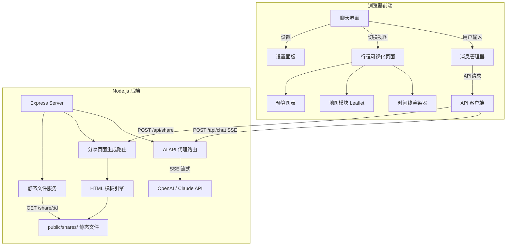

## 产品概述

一个通用的 AI 旅游规划助手 Web 应用。用户通过对话式聊天界面描述旅行需求（目的地、天数、人数、预算、偏好等），AI 大模型实时生成个性化的结构化旅行行程。生成的行程以精美的可视化页面呈现，并支持一键生成独立的分享链接，方便发送给旅伴查看。

## 核心功能

### 1. 对话式 AI 规划

- 聊天界面，用户用自然语言描述旅行需求
- AI 逐步引导用户完善需求（目的地、出行日期、天数、人数、预算、兴趣偏好等）
- AI 回复支持流式输出（打字机效果），体验流畅
- 支持多轮对话，用户可追问或要求修改行程细节

### 2. 行程可视化展示

- AI 生成的结构化行程数据自动渲染为精美的时间线页面
- 包含每日行程安排（景点、餐饮、交通）、预算估算、住宿推荐、美食推荐、实用贴士
- 支持按天切换查看，卡片式布局，交互式地图标记景点

### 3. 分享功能

- 一键生成独立的行程分享页面（静态 HTML）
- 分享页面无需登录即可查看，包含完整的行程可视化内容
- 支持复制分享链接

### 4. 设置面板

- 用户配置自己的大模型 API Key（支持 OpenAI / Claude）
- 模型选择（GPT-4o / Claude 3.5 等）
- API Key 本地存储，不上传服务器

## 技术栈

- **前端**：HTML + CSS (Tailwind CSS) + JavaScript（原生，无框架构建依赖）
- **后端**：Node.js + Express（轻量 API 代理服务器）
- **AI 接入**：OpenAI API / Anthropic Claude API（用户提供 Key，后端代理转发）
- **地图**：Leaflet + OpenStreetMap（免费开源，无需 API Key）
- **图标**：Font Awesome 6（CDN）
- **字体**：Google Fonts — Poppins + Noto Sans SC
- **Markdown 渲染**：marked.js（CDN，用于渲染 AI 对话中的 Markdown 内容）
- **代码高亮**：highlight.js（可选，用于 AI 返回的代码块）

## 实现方案

### 整体策略

采用前后端分离架构。前端是一个单页应用（SPA），包含三大视图：聊天界面、行程可视化页面、设置面板。后端是一个轻量 Express 服务器，主要职责是代理转发 AI API 请求（避免前端暴露 API Key）和托管生成的分享页面。

用户在聊天界面输入旅行需求 → 前端将消息和 API Key 发送到后端 → 后端调用大模型 API（附带精心设计的 System Prompt，要求返回结构化 JSON 行程数据）→ 流式返回前端 → 前端解析 JSON 并渲染为精美行程页面 → 用户点击分享时，后端生成独立 HTML 文件并返回分享链接。

### 关键技术决策

1. **后端代理模式**：API Key 不存储在后端，而是前端每次请求时附带在请求头中，后端仅做转发。这样既保护了 Key 不暴露在浏览器网络请求中（同源请求），又不需要后端存储用户敏感信息。
2. **结构化输出**：通过精心设计的 System Prompt + Few-shot 示例，引导大模型输出固定 JSON Schema 的行程数据。同时 AI 的自然语言回复和结构化数据分开处理——对话消息流式展示，结构化行程数据在最终确认后一次性解析渲染。
3. **分享页面生成**：后端将行程 JSON 数据嵌入一个预制的 HTML 模板中，生成独立的静态 HTML 文件，保存到 `public/shares/` 目录，通过唯一 ID 访问。分享页面完全自包含，无需后端 API 即可展示。
4. **Leaflet 地图**：使用 Leaflet + OpenStreetMap 瓦片，完全免费无需 Key，支持景点标记和路线展示。

### 性能与可靠性

- AI 回复采用 SSE（Server-Sent Events）流式传输，用户无需等待完整响应
- API Key 仅存在 localStorage 和请求传输中，后端不持久化
- 分享页面为纯静态 HTML，加载快、无依赖
- 前端对 AI 返回的 JSON 做容错解析，处理格式异常情况
- 聊天历史存储在 localStorage，刷新页面不丢失

## 架构设计



### 数据流

1. **对话流**：用户输入 → 前端组装消息历史 → POST /api/chat（附带 API Key）→ 后端转发到 AI API → SSE 流式返回 → 前端逐字渲染
2. **行程生成流**：AI 返回包含 `[TRIP_DATA]` 标记的结构化 JSON → 前端检测并解析 → 自动切换到行程可视化视图 → 渲染时间线/地图/预算
3. **分享流**：用户点击分享 → 前端将行程 JSON POST /api/share → 后端生成静态 HTML 文件 → 返回分享 URL → 前端展示可复制链接

## 目录结构

```
project-root/
├── server.js                       # [NEW] Express 后端入口。配置路由、静态文件服务、CORS。包含 /api/chat（AI代理SSE流式转发）、/api/share（生成分享页面）两个核心路由
├── package.json                    # [NEW] 项目配置。定义 name、scripts（start/dev）、dependencies（express、openai、@anthropic-ai/sdk、uuid）
├── .env.example                    # [NEW] 环境变量示例文件。说明可选的默认 API Key 配置项和端口号
├── public/                         # 前端静态资源目录（Express 静态托管）
│   ├── index.html                  # [NEW] 前端主页面。包含三大视图容器（聊天界面、行程可视化、设置面板）的 HTML 骨架，引入所有 CSS/JS 资源
│   ├── css/
│   │   └── style.css               # [NEW] 全局样式。Tailwind CSS 基础上的自定义样式：聊天气泡、行程卡片、时间线、地图容器、设置面板、响应式布局、动画关键帧、深色主题变量
│   ├── js/
│   │   ├── app.js                  # [NEW] 前端主入口。视图路由管理（聊天/行程/设置切换）、初始化各模块、全局事件绑定
│   │   ├── chat.js                 # [NEW] 聊天模块。消息收发、SSE 流式接收与逐字渲染、消息历史管理（localStorage）、AI 回复中结构化数据检测与提取、Markdown 渲染
│   │   ├── trip-renderer.js        # [NEW] 行程可视化渲染器。将结构化行程 JSON 渲染为精美页面：每日时间线、景点卡片、餐饮推荐、交通信息、住宿卡片、预算概览、实用贴士，支持按天切换
│   │   ├── map.js                  # [NEW] 地图模块。Leaflet 初始化、景点标记（自定义图标）、按天路线连线、点击弹窗详情、天数筛选
│   │   ├── share.js                # [NEW] 分享模块。调用后端生成分享页面、复制链接到剪贴板、分享成功 Toast 提示
│   │   ├── settings.js             # [NEW] 设置模块。API Key 输入与本地存储、模型选择（OpenAI/Claude + 具体模型）、Key 有效性验证、设置导入导出
│   │   └── utils.js                # [NEW] 工具函数。日期格式化、货币格式化、UUID 生成、DOM 操作辅助、动画工具、防抖节流
│   └── shares/                     # 生成的分享页面存放目录（运行时自动创建）
│       └── .gitkeep                # [NEW] 占位文件，保持目录结构
└── templates/
    └── share-template.html         # [NEW] 分享页面 HTML 模板。自包含的精美行程展示页面模板，内嵌 Tailwind CSS/Leaflet/Chart，后端将行程 JSON 注入此模板生成独立 HTML 文件
```

## 关键代码结构

```javascript
// AI 返回的结构化行程数据 Schema
const TripDataSchema = {
  destination: "string",          // 目的地名称
  dateRange: { start: "string", end: "string" },  // 日期范围
  travelers: "number",            // 出行人数
  totalBudget: { local: "number", cny: "number", currency: "string" },
  days: [{
    day: "number",
    date: "string",
    city: "string",
    theme: "string",              // 当日主题
    activities: [{
      time: "string",             // "09:00-12:00"
      type: "attraction|food|transport",
      name: "string",
      description: "string",
      cost: { local: "number", cny: "number" },
      location: { lat: "number", lng: "number" },
      tips: "string"
    }],
    accommodation: {
      name: "string", area: "string",
      priceRange: "string",
      location: { lat: "number", lng: "number" }
    },
    dailyBudget: { local: "number", cny: "number" }
  }],
  budget: {
    categories: [{ name: "string", local: "number", cny: "number" }],
    total: { local: "number", cny: "number" }
  },
  foods: [{ name: "string", description: "string", restaurant: "string", city: "string", priceRange: "string" }],
  tips: { visa: "string", currency: "string", weather: "string", communication: "string", transport: "string", safety: "string" }
};
```

```javascript
// 后端 AI 代理路由核心签名 (server.js)
// POST /api/chat - SSE 流式代理
// Request: { messages: Array, apiKey: string, provider: "openai"|"anthropic", model: string }
// Response: SSE stream (text/event-stream)

// POST /api/share - 生成分享页面
// Request: { tripData: TripDataSchema }
// Response: { shareUrl: string, shareId: string }
```

## 设计风格

采用现代深色主题聊天界面风格，融合旅行元素的视觉设计。聊天界面以深色背景为主（沉浸式对话体验），行程展示页面切换为明亮的旅行杂志风格（热带渐变色调、玻璃拟态卡片）。整体设计在专业工具感与旅行浪漫感之间取得平衡。

## 页面规划

本应用为单页应用（SPA），包含三大视图，通过导航切换：

### 视图 1：聊天界面（主视图）

- **顶部导航栏**：深色半透明玻璃拟态背景，左侧应用 Logo 和名称"AI Travel Planner"，中部导航标签（对话/行程/设置），右侧显示当前模型名称和连接状态小圆点。导航标签切换带底部滑块动画
- **聊天消息区**：占据页面主体，深色背景（#0F172A）。AI 消息靠左排列，带青绿色渐变左边框和半透明深色气泡背景；用户消息靠右排列，带主题色渐变气泡。消息支持 Markdown 渲染（标题/列表/加粗/代码块）。AI 消息底部有"查看行程"快捷按钮（当检测到行程数据时自动出现）。消息入场带淡入上移动画
- **欢迎引导区**：首次打开时显示在聊天区中央，包含应用 Logo 大图标、欢迎语"你好，我是你的 AI 旅行规划师"、三个快捷提问卡片（"帮我规划一次马来西亚五一之旅"/"推荐东南亚海岛度假"/"帮我做一个 7 天日本行程"），点击直接发送对应消息
- **输入区域**：底部固定，圆角输入框带微发光边框效果，右侧发送按钮（渐变色圆形），输入框支持多行自动扩展（最大 4 行），按 Enter 发送、Shift+Enter 换行

### 视图 2：行程可视化页面

- **行程头部**：渐变色（青绿到蓝）大标题区域，显示目的地名称、日期范围、人数和总预算，底部有"返回对话"和"分享行程"两个操作按钮
- **天数选择 Tab 栏**：吸顶横向滚动标签，每天一个圆角标签显示"Day X · 城市名"，选中态为主题色渐变填充
- **每日时间线**：左侧渐变色时间轴线，右侧卡片式展示每个活动。景点卡片（青绿色标签）、餐饮卡片（橙色标签）、交通卡片（蓝色标签）分别用不同主题色区分。每张卡片包含时间、名称、描述、费用徽章。卡片带入场淡入动画
- **地图区域**：行程下方嵌入 Leaflet 地图，展示当天景点标记和路线连线，支持点击查看详情弹窗。地图容器为圆角带阴影
- **预算概览**：环形图展示各类费用占比，下方分类卡片列表
- **美食与住宿推荐**：双栏卡片布局，美食卡片带渐变遮罩背景图，住宿卡片展示评分和价格
- **实用贴士**：可展开折叠的手风琴列表，各类贴士带对应图标

### 视图 3：设置面板

- **API 配置区**：卡片式表单，包含 Provider 选择（OpenAI/Anthropic 切换按钮组）、API Key 输入框（密码模式，带显示/隐藏切换）、模型下拉选择。"验证 Key"按钮点击后显示验证结果
- **偏好设置**：语言选择、货币单位偏好
- **关于信息**：版本号、使用说明简要描述

## 交互与动画

- 聊天消息流式输出时带光标闪烁效果
- 视图切换带水平滑动过渡
- 行程卡片滚动入场带交错淡入动画
- 按钮悬浮带发光涟漪效果
- 分享成功时弹出 Toast 通知（从底部滑入后自动消失）
- 天数 Tab 切换带内容滑动过渡
- 地图标记点击带弹跳动画

## 响应式设计

- 桌面端（大于 1024px）：聊天区域居中最大宽度 800px，行程页面双栏布局
- 平板端（768-1024px）：全宽布局，行程单栏
- 移动端（小于 768px）：全宽紧凑布局，输入框简化，汉堡菜单导航

## Agent Extensions

### Skill

- **tencentmap-lbs-skill**
- 用途：在分享页面模板中集成腾讯地图 JS API，为行程可视化页面和分享页面提供地图展示能力（景点标记、路线规划、POI 搜索）
- 预期结果：获取腾讯地图 JS API Key 配置方式，并在地图模块中实现景点标记和路线连线功能

- **多模态内容生成**
- 用途：生成应用欢迎页面和分享页面模板中使用的旅行主题装饰图片，提升视觉品质
- 预期结果：生成一张现代风格的旅行主题 Hero 背景图，用于聊天界面欢迎区域