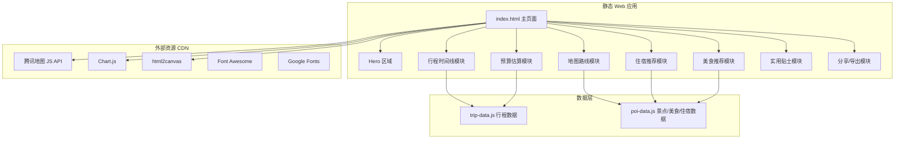

## 用户需求

开发一个马来西亚五一旅游规划助手 Web 应用，生成精美的旅行规划页面，方便分享给同行朋友查看。

## 产品概述

一个精美的马来西亚五一假期旅游规划 Web 应用。页面内置 AI 精心策划的 7 天混合行程方案（涵盖城市观光、海岛度假、文化美食、自然探险），以时间线形式展示每日详细安排，并配有交互式地图、预算估算、美食推荐、住宿推荐和实用贴士等模块。支持一键分享链接或导出为图片，方便发送给旅伴查看。

## 核心功能

### 1. 每日行程时间线

- 以天为单位展示 7 天行程（4月30日 - 5月6日）
- 每天包含：景点安排（含简介和图片）、餐饮推荐、交通方式与耗时
- 支持点击切换不同天数查看，带有平滑过渡动画

### 2. 交互式地图路线展示

- 集成地图展示所有景点标记点
- 按天展示路线连线，支持点击标记查看景点详情弹窗
- 支持腾讯地图 POI 搜索与路径规划

### 3. 预算估算模块

- 分类展示：机票、住宿、餐饮、交通、门票、其他
- 以可视化图表（环形图）展示各项占比
- 显示总预算和每日平均花费（人民币 + 马来西亚林吉特）

### 4. 住宿推荐

- 按行程天数推荐住宿区域和酒店
- 展示价格区间、评分、地理位置优势

### 5. 美食推荐

- 推荐马来西亚必尝美食清单
- 标注推荐餐厅、价格区间、所在城市

### 6. 实用贴士

- 签证政策、货币兑换、天气情况、通讯网络、交通出行、安全提醒等

### 7. 分享功能

- 支持复制当前页面链接分享
- 支持将规划导出为长图保存

## 技术栈

- **前端框架**：纯 HTML + CSS + JavaScript（单文件应用，零构建依赖，直接浏览器打开即可运行）
- **地图服务**：腾讯地图 JavaScript API（通过 [skill:tencentmap-lbs-skill] 获取 POI 数据和路径规划）
- **图表库**：Chart.js（CDN 引入，用于预算环形图）
- **图标库**：Font Awesome（CDN 引入）
- **字体**：Google Fonts - Poppins + Noto Sans SC
- **导出图片**：html2canvas（CDN 引入，用于生成分享长图）
- **部署**：静态文件，可通过 Cloud Studio / EdgeOne Pages 一键部署，或直接本地打开

## 实现方案

### 整体策略

构建一个单页 Web 应用（SPA），所有行程数据以 JSON 格式内置于 JavaScript 中（AI 精心策划的 7 天马来西亚行程方案）。页面采用模块化设计，通过 Tab / 滚动导航切换不同功能区域。地图通过腾讯地图 JS API 渲染，支持标记点和路线展示。

### 关键技术决策

1. **纯静态方案**：无需后端服务器，HTML 文件可直接打开或部署到任意静态托管，降低使用门槛，分享时只需发送链接
2. **数据内置**：行程、美食、住宿等数据预先编排好嵌入 JS 中，避免 API 依赖，确保离线也能查看
3. **单文件 + 资源 CDN**：核心逻辑在一个 HTML 文件中，第三方库通过 CDN 加载，保持项目简洁
4. **腾讯地图**：使用 skill 获取真实 POI 和路线数据，增强地图展示的准确性和实用性

### 性能考量

- 图片使用 lazy loading，避免首屏加载过慢
- CSS 动画使用 `transform` 和 `opacity`，确保 GPU 加速
- 地图标记使用聚合策略，避免大量标记导致卡顿
- html2canvas 导出在用户主动触发时执行，不影响正常浏览体验

## 架构设计

### 系统架构



### 数据流

用户打开页面 → 加载 HTML + CSS + JS → 渲染 Hero 和导航 → 按模块懒加载内容 → 地图初始化并标记景点 → 用户交互（切换天数/点击景点/查看详情）→ 分享时生成链接或导出图片

## 目录结构

```
project-root/
├── index.html              # [NEW] 主页面入口。包含完整的 HTML 结构、所有模块的 DOM 布局，引入外部 CDN 资源和本地 JS/CSS 文件。包含 Hero Banner、导航栏、7 个功能模块区域和页脚
├── css/
│   └── style.css           # [NEW] 全局样式表。包含 CSS 变量定义（颜色/字体/间距）、响应式布局、动画关键帧、各模块的详细样式。采用 BEM 命名规范，移动端优先的媒体查询
├── js/
│   ├── app.js              # [NEW] 主应用逻辑。负责页面初始化、导航交互、滚动动画、天数切换、模块懒加载、事件绑定等核心交互逻辑
│   ├── map.js              # [NEW] 地图模块。初始化腾讯地图实例，渲染景点标记、路线连线、信息窗口弹窗，支持按天筛选显示不同路线
│   ├── charts.js           # [NEW] 图表模块。使用 Chart.js 绘制预算环形图和分类柱状图，处理数据格式化和图表响应式适配
│   ├── share.js            # [NEW] 分享导出模块。实现复制链接、html2canvas 导出长图、下载图片功能，包含导出进度提示和错误处理
│   └── data/
│       ├── trip-data.js    # [NEW] 行程数据。包含 7 天每日行程的完整 JSON 数据：日期、城市、景点列表（名称/简介/时间/费用）、餐饮安排、交通方式与耗时、住宿信息
│       └── poi-data.js     # [NEW] POI 数据。包含所有景点/餐厅/酒店的经纬度坐标、详细信息、图片 URL、评分等，供地图模块和各推荐模块使用
└── assets/
    └── images/
        └── hero-bg.svg     # [NEW] Hero 区域装饰性 SVG 背景图。马来西亚标志性元素的矢量插画（双子塔剪影、棕榈树、海洋元素）
```

## 关键代码结构

```javascript
// trip-data.js 核心数据结构
const TRIP_DATA = {
  title: "马来西亚七日深度游",
  dateRange: { start: "2026-04-30", end: "2026-05-06" },
  travelers: 1,
  days: [
    {
      day: 1,
      date: "2026-04-30",
      city: "吉隆坡",
      theme: "城市初印象",
      activities: [
        {
          time: "09:00-12:00",
          type: "attraction", // attraction | food | transport
          name: "双子塔 & KLCC 公园",
          description: "...",
          cost: { myr: 80, cny: 128 },
          location: { lat: 3.1578, lng: 101.7117 },
          tips: "建议提前网上购票"
        }
        // ...更多活动
      ],
      accommodation: {
        name: "...", area: "...", priceRange: "...",
        location: { lat: 0, lng: 0 }
      },
      dailyBudget: { myr: 500, cny: 800 }
    }
    // ...更多天数
  ],
  budget: {
    flights: { myr: 2000, cny: 3200 },
    accommodation: { myr: 2100, cny: 3360 },
    food: { myr: 1050, cny: 1680 },
    transport: { myr: 700, cny: 1120 },
    tickets: { myr: 500, cny: 800 },
    other: { myr: 350, cny: 560 },
    total: { myr: 6700, cny: 10720 }
  },
  tips: {
    visa: "...", currency: "...", weather: "...",
    communication: "...", safety: "..."
  }
};
```

## 设计风格

采用现代旅游杂志风格，融合热带海岛氛围与都市时尚感。整体视觉以渐变蓝绿色调为主，搭配金色点缀，营造马来西亚热带风情。大量使用圆角卡片、柔和阴影和玻璃拟态效果，配合滚动视差动画，打造沉浸式旅行规划阅读体验。

## 页面规划

本应用为单页滚动式设计，共包含以下 6 个核心区域：

### 页面 1：Hero Banner + 行程概览

- **顶部导航栏**：固定在顶部，半透明玻璃拟态背景，左侧 Logo"马来西亚旅行规划"，右侧导航菜单（行程/地图/预算/美食/贴士/分享），滚动时添加阴影效果
- **Hero Banner 区域**：全屏高度，深蓝到青绿色渐变背景叠加马来西亚标志性剪影 SVG 装饰，居中大标题"马来西亚七日深度游"，副标题显示日期范围，下方三个亮点标签（7天行程/5座城市/全方位体验），底部渐入的向下滚动提示箭头动画
- **行程概览卡片**：水平滚动的 7 张日期卡片，展示每天的城市和主题图标，当前选中天高亮放大，点击跳转到对应行程详情
- **快速统计栏**：四列图标+数字展示（总天数/城市数/预算/景点数），数字带计数动画

### 页面 2：每日行程时间线

- **天数选择 Tab 栏**：吸顶设计，7 个圆形天数按钮，选中状态带渐变底色和微动画
- **时间线主体**：左侧时间轴线（渐变色竖线），右侧交替排列行程卡片。每张卡片包含时间标签、活动类型图标（景点/餐饮/交通用不同颜色区分）、活动名称、简要描述、费用标签。卡片带入场淡入动画
- **当日住宿卡片**：每天时间线末尾展示推荐住宿，卡片内含酒店名、区域、价格范围、地图小图
- **当日小结**：圆角渐变背景的统计条，展示当日总花费、步行距离、景点数量

### 页面 3：交互式地图

- **地图控制栏**：顶部天数筛选按钮组，可选择查看某一天或全部路线
- **腾讯地图区域**：占据页面主体，展示马来西亚地图，标记所有景点点位（不同类型用不同颜色图标），天数路线用彩色连线表示
- **景点详情侧边面板**：点击标记弹出右侧滑入面板，展示景点照片、名称、描述、建议游玩时间、门票价格
- **路线信息条**：地图下方展示当前选中天的总路程和预估交通时间

### 页面 4：预算估算

- **总预算卡片**：大号圆角玻璃拟态卡片，居中展示总金额（CNY），下方小字显示 MYR 金额，带有金色装饰边框
- **分类环形图**：Chart.js 绘制的渐变色环形图，展示六大类别占比，中心显示总金额，悬浮显示具体数值
- **分类明细列表**：六张横排卡片，每张展示类别图标、名称、金额、占比进度条，使用对应类别的主题色
- **每日预算趋势**：简洁的每日花费柱状图，标注花费最高和最低的日期

### 页面 5：美食与住宿推荐

- **美食推荐区**：瀑布流布局的美食卡片，每张卡片含美食图片（渐变遮罩叠加）、名称、描述、推荐餐厅、价格范围、所在城市标签。卡片悬浮时微微放大带阴影加深效果
- **住宿推荐区**：按城市分组的住宿卡片列表，每张卡片展示酒店名称、星级、价格区间、位置优势描述、评分标签
- **本地美食 TOP 榜**：横向滚动的排名条，展示必吃美食 TOP 10，带序号和小图标

### 页面 6：实用贴士 + 分享

- **贴士手风琴列表**：可展开折叠的贴士分类（签证政策/货币兑换/天气穿搭/通讯网络/交通出行/安全提醒），每项展开后展示详细图文内容，左侧带分类图标
- **行前清单**：可勾选的打包清单卡片（证件类/衣物类/电子设备/药品日用），勾选状态保存在 localStorage
- **分享操作区**：居中的分享卡片，上方展示旅行规划封面缩略图，下方两个操作按钮——"复制链接"（带复制成功 Toast 提示）和"保存为图片"（触发 html2canvas 导出）
- **页脚**：简洁页脚，展示"Powered by AI Travel Planner"和制作日期

## 交互与动画

- 页面滚动时，各模块卡片依次淡入上移（Intersection Observer 实现）
- 天数切换时，时间线内容带滑动过渡效果
- 地图标记点击带弹跳动画
- 数字统计带计数递增动画
- 按钮悬浮带渐变色微光扫过效果
- 导航栏滚动时平滑变换背景透明度

## 响应式设计

- 桌面端（大于 1024px）：双栏/三栏布局，地图占大面积
- 平板端（768px-1024px）：两栏布局，地图全宽
- 移动端（小于 768px）：单栏堆叠布局，时间线简化为紧凑模式，地图支持全屏展开，导航栏变为汉堡菜单

## Agent Extensions

### Skill

- **tencentmap-lbs-skill**
- 用途：获取马来西亚各景点的 POI 信息（经纬度、名称、评分）以及城市间/景点间的路径规划数据，生成真实准确的地图标记和路线数据
- 预期结果：获取吉隆坡、马六甲、兰卡威、沙巴等城市的景点/餐厅/酒店 POI 坐标数据，以及每日行程的路线规划信息，写入 poi-data.js

- **多模态内容生成**
- 用途：生成 Hero 区域的马来西亚主题装饰背景图片，提升页面视觉冲击力
- 预期结果：生成一张融合马来西亚标志性元素（双子塔、热带海岛、棕榈树）的精美背景图片