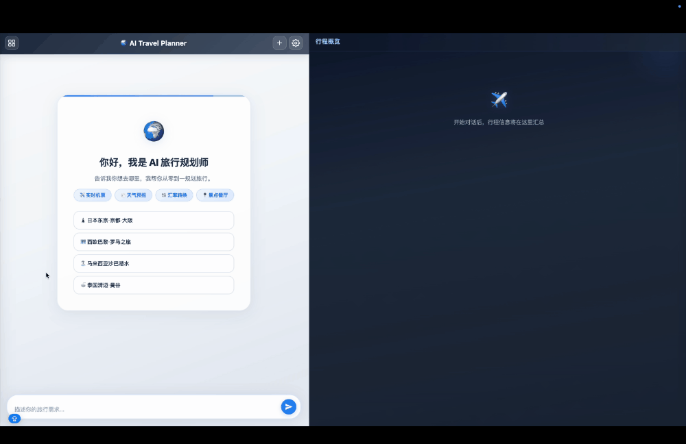

# TripMate — AI Travel Companion

> 一个真正懂旅行的 AI 伴侣：出发前帮你把行程想清楚，路上陪着你随机应变，回来后把记忆拼成值得珍藏的故事。

  

---

## 项目概览

**TripMate** 是一个完整的旅行 AI 助手产品设想，覆盖旅行全生命周期：

```
行前规划 ──→ 旅行中陪伴 ──→ 动态重规划 ──→ 行后内容创作 ──→ 社区分享
   │
   │  ← 你现在在这里
   ▼
┌──────────────────────────────┐
│  AI Travel Planner (本项目)    │
│  行前规划环节的完整可运行 Demo  │
└──────────────────────────────┘
```

本仓库包含两部分内容：

| 目录 | 内容 | 说明 |
|------|------|------|
| **`/`** (根目录) | **AI Travel Planner** | 行前规划环节的完整 Demo，可直接运行体验 |
| **`/TripMate`** | **TripMate 产品设计** | 完整产品 PRD + 交互 Demo，展示全貌愿景 |

---

## TripMate 产品愿景

TripMate 不是查询工具，也不是日程软件。它更像一个你信任的旅伴。

| 阶段 | 传统方式 | TripMate |
|------|---------|----------|
| **行前** | 刷小红书收藏几百条，自己整合成表格 | AI 理解你的偏好，主动规划，路线合理可执行 |
| **行中** | 对着攻略一步步执行 | AI 感知实际状态，主动提醒和调整，你只需要走 |
| **行后** | 照片在手机里积灰，游记永远写不完 | AI 整理素材框架，你填入真实感受，内容有温度 |
| **社区** | 看别人的攻略，手动抄到自己的表格里 | 一键复制行程到自己的规划，从看到用无缝衔接 |

五大核心模块：

1. **行前规划** — 偏好输入 → AI 生成行程（地图+时间轴双视图）→ 自然语言修改
2. **旅行中陪伴** — 沉浸式主界面、景点打卡导览、快捷记录（拍照/录像/录音）
3. **动态重规划** — 偏差检测 → AI 自动生成调整方案 → 用户一键确认
4. **行后内容创作** — AI 整理素材框架 → 用户自写图文游记 / 逐站点评行程攻略
5. **旅行内容社区** — 游记 + 行程攻略双轨内容，攻略可一键复制

> 📄 完整 PRD 见 [`docs/TripMate-PRD.md`](docs/TripMate-PRD.md)
> 🖥️ 交互 Demo 见 [`docs/TripMate-Demo.html`](https://geraldhzy.github.io/TripMate/TripMate-Demo.html)（浏览器直接打开）

---

## AI Travel Planner Demo

TripMate 行前规划环节的完整实现 — 通过自然对话，自动搜索机票、调研目的地、规划每日行程，生成完整旅行方案。



### 功能特性

- **渐进式行程规划** — 4 个阶段逐步推进：需求确认 → 机票调研 → 详情填充 → 预算总结
- **实时机票搜索** — 通过 Google Flights 获取真实航班报价
- **多 Agent 并行** — 机票搜索和目的地调研同时进行，节省等待时间
- **右侧行程看板** — 实时展示规划进度、每日行程时间线、预算和行前准备
- **PDF 导出** — 规划完成后一键导出为 PDF，方便离线查看
- **行程历史** — 自动保存规划记录，随时继续上次对话
- **阶段回退** — 修改目的地等关键信息时自动清理过时数据重新规划

### 快速开始

#### 环境要求

- **Node.js 18+**（[下载](https://nodejs.org)）
- **Python 3.8+**（[下载](https://www.python.org)，机票和酒店搜索需要）

#### 3 步启动

```bash
git clone https://github.com/your-username/ai-travel-planner.git
cd ai-travel-planner
./start.sh
```

脚本会自动安装所有依赖（Node.js + Python）并打开浏览器。

#### 配置 API Key

首次打开后点击右上角 ⚙️ 设置，填入两个 Key 即可使用：

| 配置项 | 获取方式 |
|--------|---------|
| **AI API Key** | [DeepSeek](https://platform.deepseek.com/)（推荐）/ [OpenAI](https://platform.openai.com/) / [Anthropic](https://console.anthropic.com/) / [Kimi](https://platform.moonshot.cn/) / [智谱GLM](https://open.bigmodel.cn/) / [MiniMax](https://platform.minimaxi.com/) |
| **Brave Search API Key** | [免费申请](https://brave.com/search/api/)（每月 2000 次免费额度） |

> 所有 Key 仅存储在浏览器本地（localStorage），不会上传到任何服务器。

### 使用流程

```
用户: "帮我规划一个7天日本东京+京都之旅，2人，预算每人2万"
    │
    ▼
📋 阶段1：确认需求（目的地、日期、人数、预算、旅行节奏）
    │  ← 用户确认
    ▼
✈️ 阶段2：搜索机票 + 调研目的地（签证、交通、天气、美食）
    │  ← 用户确认框架
    ▼
🗺️ 阶段3：填充每日详细行程（景点、餐厅、酒店、交通）
    │  ← 用户确认详情
    ▼
💰 阶段4：生成预算总结 + 行前准备 → 📄 导出PDF
```

### 技术架构

```
┌─────────────────────────────────────────────┐
│  浏览器                                      │
│  ┌──────────────────┐ ┌──────────────────┐  │
│  │   对话区域        │ │  行程看板         │  │
│  │   (SSE 流式)     │ │  (实时更新)       │  │
│  └──────────────────┘ └──────────────────┘  │
└──────────────────┬──────────────────────────┘
                   │ SSE
┌──────────────────▼──────────────────────────┐
│  Node.js + Express                           │
│  ┌─────────────────────────────────────┐    │
│  │  主 Agent（循环调用工具）             │    │
│  │  ├─ update_trip_info  → TripBook    │    │
│  │  ├─ web_search        → Brave API   │    │
│  │  ├─ search_poi        → Brave API   │    │
│  │  ├─ search_hotels     → Google      │    │
│  │  └─ delegate_to_agents              │    │
│  │       ├─ flight Agent → Google Flights│   │
│  │       └─ research Agent → Brave API  │   │
│  └─────────────────────────────────────┘    │
└─────────────────────────────────────────────┘
```

- **后端**：Node.js + Express，SSE 流式输出
- **前端**：原生 HTML/CSS/JS，无框架依赖
- **AI**：支持 DeepSeek V3（推荐）/ OpenAI GPT-4o / Anthropic Claude / Kimi / 智谱GLM / MiniMax
- **搜索**：Brave Search API
- **机票**：fast-flights（Google Flights 爬虫）
- **酒店**：Playwright（Google Hotels 爬虫）

### 项目结构

```
ai-travel-planner/
├── server.js              # 主服务器 + Agent 循环
├── start.sh               # 一键启动脚本
├── agents/                 # 子 Agent（机票搜索、目的地调研）
│   ├── config.js           # Agent 配置（工具列表、轮次限制）
│   ├── delegate.js         # 并行委派执行器
│   ├── sub-agent-runner.js # 子 Agent 运行时
│   └── prompts/            # Agent 专属 Prompt
├── tools/                  # 工具实现
│   ├── web-search.js       # Brave Search API
│   ├── poi-search.js       # POI 搜索（封装 web-search）
│   ├── flight-search.js    # 机票搜索（调用 Python）
│   ├── hotel-search.js     # 酒店搜索（调用 Python）
│   ├── update-trip-info.js # TripBook 更新工具
│   └── scripts/            # Python 搜索脚本
├── models/                 # 数据模型
│   └── trip-book.js        # TripBook — 行程数据中心
├── prompts/                # System Prompt
│   └── system-prompt.js    # 主 Agent Prompt（状态机 + 工具策略）
├── public/                 # 前端静态文件
│   ├── index.html
│   ├── css/style.css
│   └── js/
│       ├── chat.js         # 对话逻辑 + SSE 处理
│       └── itinerary.js    # 行程看板渲染 + PDF 导出
├── middleware/              # Express 中间件（安全、校验）
├── utils/                  # 工具函数（日志、常量）
├── __tests__/              # Jest 测试
├── docs/                   # 设计文档
│   ├── ARCHITECTURE.md
│   └── PRD.md
└── TripMate/               # TripMate 完整产品设计
    ├── TripMate-PRD.md     # 产品需求文档
    └── TripMate-Demo.html  # 交互原型 Demo
```

---

## 开发

```bash
# 运行测试
npm test

# 调试模式启动（终端输出日志）
./start.sh --debug

# 开启搜索调试日志
WEB_SEARCH_DEBUG=true npm start
```

## 问题与局限

- 机票/酒店/POI搜索依赖 Google Flights/Hotels Brave Search 爬虫，存在不稳定性
- 规划进度提示机制有待优化，存在运行时间较长而前端进度提示不足的情况，需耐心等待
- 预算数据依赖解析大模型输出，复杂情况存在错误
- 仅适配了 MacOS/Linux 桌面端，Windows 和移动端需要额外配置


